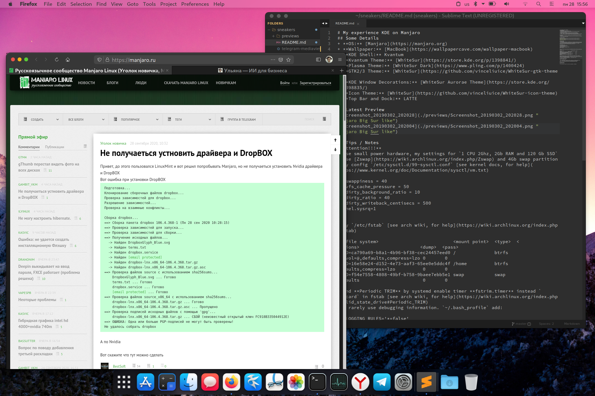

# My experience KDE on Manjaro
## Some Details
+ **OS:** [Manjaro](https://manjaro.org)
+ **Wallpaper:** [MacBook](https://wallpapercave.com/wallpaper-macbook)
+ **KDE Shell:** Kvantum
+ **Kvantum Theme:** [WhiteSur](https://store.kde.org/p/1398841/)
+ **Plasma Theme:** [WhiteSur Dark](https://www.pling.com/p/1400424)
+ **GTK2/3 Theme:** [WhiteSur](https://github.com/vinceliuice/WhiteSur-gtk-theme)
+ **Firefox Theme:** WhiteSur
+ **KDE Window Decorations:** [WhiteSur Aurorae Theme](https://store.kde.org/p/1398835/)
+ **Icon Theme:** [WhiteSur](https://github.com/vinceliuice/WhiteSur-icon-theme)
+ **Top Bar and Dock:** LATTE

## Latest Preview



## Tips / Notes
I use hardware, `4 CPU 3Ghz, 16Gb RAM and 512 Gb SSD`
+ Use 16Gb swap partition
+ My config `/etc/sysctl.d/99-sysctl.conf` [see kernel docs, for help](https://www.kernel.org/doc/Documentation/sysctl/vm.txt)
```
vm.swappiness = 10
vm.vfs_cache_pressure = 50
vm.dirty_background_ratio = 10
vm.dirty_ratio = 40
vm.dirty_writeback_centisecs = 500
kernel.sysrq = 1
```
+ My `/etc/fstab` [see arch wiki, for help](https://wiki.archlinux.org/index.php/fstab)
```
# <file system>             <mount point>  <type>  <options>  <dump>  <pass>
UUID=C059-2B81                            /boot/efi      vfat    umask=0077 0 2
UUID=eb67ddb3-4029-4363-a09a-dcdab0834cf1 /              ext4    defaults,noatime 0 1
UUID=bd60a1ca-1fbd-4ae7-ac41-226aaad05d6c swap           swap    defaults,noatime 0 2
```
+ I rarely use debugging information. `~/.bash_profile` add:
```
QT_LOGGING_RULES='*=false'
export QT_LOGGING_RULES
```
+ Use `kdebugdialog5` terminal command, disable any debugging information.
+ Edit `/etc/systemd/journald.conf` [see systemd docs, for help](https://www.freedesktop.org/software/systemd/man/journald.conf)
```
Storage=volatile
RuntimeMaxUse=10M
```
+ You can open an issue if you have any questions / problems.

