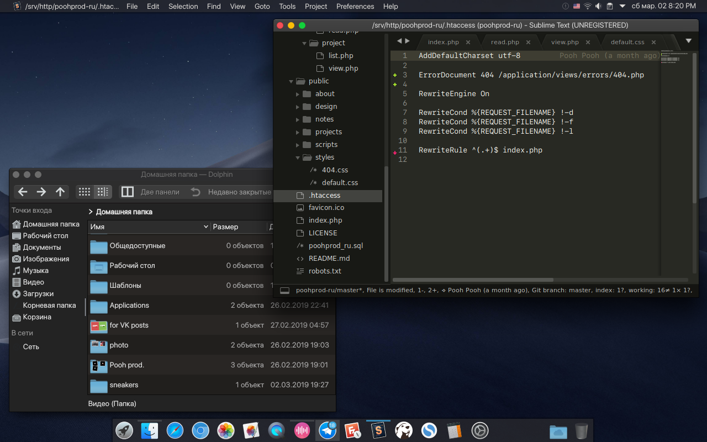

# My experience KDE on Manjaro
## Some Details
+ **OS:** [Manjaro](https://manjaro.org)
+ **Wallpaper:** [Mojave Night](https://hdqwalls.com/wallpaper/3840x2160/macos-mojave-night-mode-stock)
+ **KDE Shell:** Kvantum
+ **Kvantum Theme:** [Mojave Dark](https://store.kde.org/p/1252328/)
+ **Plasma Theme:** [Breeze Transparent Dark](https://store.kde.org/p/1170816/)
+ **GTK2/3 Theme:** [Mojave GTK Theme](https://github.com/vinceliuice/Mojave-gtk-theme)
+ **KDE Window Decorations:** [Mojave Dark Aurorae](https://www.opendesktop.org/p/1252329/)
+ **Icon Theme:** [Mojave CT](https://store.kde.org/p/1210856/)
+ **Top Bar and Dock:** KDE (default widget)

## Latest Preview



## Tips / Notes
**Attention!!!** 
I use small power hardware, my settings for `1 CPU 2Ghz, 2Gb RAM and 120 Gb SSD`
+ Use [Zswap](https://wiki.archlinux.org/index.php/Zswap) and 4Gb swap partition
+ My config `/etc/sysctl.d/99-sysctl.conf` [see kernel docs, for help](https://www.kernel.org/doc/Documentation/sysctl/vm.txt)
```
vm.swappiness = 40
vm.vfs_cache_pressure = 50
vm.dirty_background_ratio = 10
vm.dirty_ratio = 40
vm.dirty_writeback_centisecs = 500
kernel.sysrq=1
```
+ 
+ My `/etc/fstab` [see arch wiki, for help](https://wiki.archlinux.org/index.php/fstab)
```
# <file system>                           <mount point>  <type>  <options>                      <dump>  <pass>
UUID=ca790a69-b8a1-4b96-bf38-cec24457eed0 /              btrfs   subvol=@,defaults,compress=lzo 0       0
UUID=16e58e24-d152-4e73-aaf3-65ee0e5ddc4f /home          btrfs   defaults,compress=lzo          0       0
UUID=f54e7558-4808-49bf-b758-9baee7ebb5e1 swap           swap    defaults                       0       0
```
+ and **Periodic TRIM** by systemd enable timer **fstrim.timer** instead `discard` in fstab [see arch wiki, for help](https://wiki.archlinux.org/index.php/Solid_state_drive#Periodic_TRIM)
+ I rarely use debugging information. `~/.bash_profile` add:
```
QT_LOGGING_RULES='*=false'
export QT_LOGGING_RULES
```
+ Use `kdebugdialog5` terminal command, disable any debugging information.
+ Edit `/etc/systemd/journald.conf` [see systemd docs, for help](https://www.freedesktop.org/software/systemd/man/journald.conf)
```
Storage=volatile
RuntimeMaxUse=10M
```
+ You can open an issue if you have any questions / problems.

